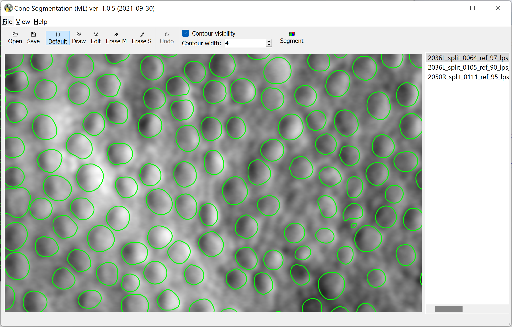
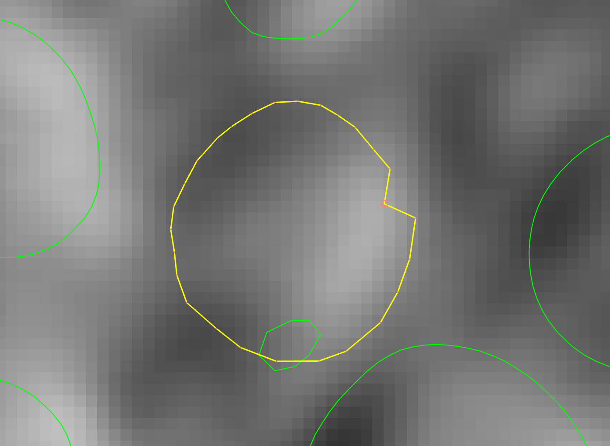
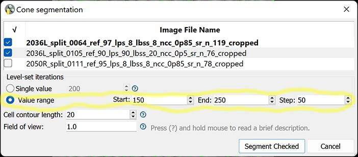
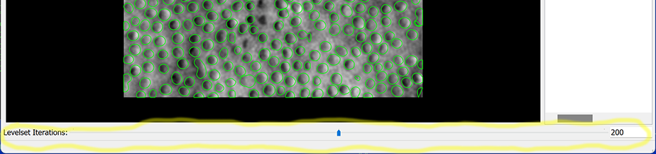

# Cone Segmentation ML (Machine Learning edition)
#### Cell segmentation on Adaptive Optics Retinal Images using pre-trained A-GAN machine learning model and manual editing.

*Jianfei Liu (NEI/NIH), Andrei Volkov (NEI/NIH Contractor), and Johnny Tam (NEI/NIH), with research support from the Intramural Research Program of the National Institutes of Health.*

### BibTeX

	@ARTICLE{9339889,
		author={Liu, Jianfei and Shen, Christine and Aguilera, Nancy and Cukras, Catherine and Hufnagel, Robert B. and Zein, Wadih M. and Liu, Tao and Tam, Johnny},
		journal={IEEE Transactions on Medical Imaging},
		title={Active Cell Appearance Model Induced Generative Adversarial Networks for Annotation-Efficient Cell Segmentation and Identification on Adaptive Optics Retinal Images},
		year={2021},
		volume={40},
		number={10},
		pages={2820-2831},
		doi={10.1109/TMI.2021.3055483}
	}
	

### This is an experimental version containing feature(s) not found in the general-purpose version.

The Segmentation dialog has an option to specify a range of values for the parameter "Level-set iterations", rather than a single value:

When selected, multiple segmentation results are produced, one per each value in the range. The range settings work as for-loop parameters {`for (n=Start; n<=End; n+=Step)`}, e.g. if Start=150, End=250 and Step=50, then results are computed for "Level-set iterations" = 150, 200 and 250. In this case a slider is enabled on the main screen, which allows the user to browse across different results:

---------------

## Setting up development environment

1. Download and install [Miniconda](https://docs.conda.io/en/latest/miniconda.html) or [Anaconda](https://www.anaconda.com/products/individual).

2. Check out **ConeSegmentationML** to a local directory `<prefix>/ConeSegementationML`. (Replace `<prefix>` with any suitable local directory).

3. Run Anaconda Prompt (or Terminal), cd to `<prefix>/ConeSegmentationML`.

4. Create Conda Virtual Environment (do this once, next time skip to the next step):

	`conda env create --file conda-environment.yml`
   
5. Activate the Virtual Environment:

	`conda activate ConeSegmentation`
   
6. Start the application:

	`python __main__.py`
  
7. Build "frozen Python" application:

	`pyinstaller --clean --noconfirm build-dir.spec`

If successful, the result is the directory `ConeSegmentationML` inside `<prefix>/ConeSegmentationML/dist/`. You can copy this directory with all its contents to a different machine, and run the executable `__main__` (in MacOS and Linux) or `__main__.exe` (in Windows). It does not need Conda VEs or other development tools.

In MacOS systems, you can build a Mac application instead:

`pyinstaller --clean --noconfirm build-app-dir.spec`

The result is `<prefix>/ConeSegmentationML/dist/ConeSegmentationML.app`.

## Creating Windows installer using NSIS

1. Download and install [NSIS](https://nsis.sourceforge.io/Download) if you don't have it already.

2. Follow steps 1 through 7 of *Setting up development environment* to build the directory containing "frozen Python" application.

3. Open Command Prompt (or Conda Prompt), cd to `<prefix>/ConeSegmentationML`.

4. Run NSIS:

`"C:\Program Files (x86)\NSIS\makensis.exe" /V4 build-win64-installer.nsi`

(Replace `C:\Program Files (x86)\NSIS` with the actual installation directory, if different from default).
If successful, the result is `<prefix>/ConeSegmentationML/dist/ConeSegmentationML-win64.exe`. This is a regular Windows installer, which can be distributed to other Windows systems. It requires admin access.

## Creating MAC OS installer (.dmg)

1. Make sure Xcode is installed (normally, via Apple App Store).

2. Follow steps 1 through 5 of *Setting up development environment* to setup the development environment.

3. At the Conda prompt with *ConeSegmentation* activated, cd to `<prefix>/ConeSegmentationML` and type the command:

	`bash make_dmg.sh`

If prompted to allow Terminal to run Finder scripts, answer "Allow". The result is `<prefix>/ConeSegmentationML/dist/ConeSegmentationML-Darwin.dmg`. It is a Mac OS disk image file; when opened, it asks for accepting the license agreement, then mounts itself as an external drive and opens a Finder window, that looks like this:

You can run the app by double-clicking on the icon, or copy it to your Applications folder by dragging the icon over "Applications". Once ConeSegmentationML is in your Applications folder, you can eject the *ConeSegmentationML* disk, and delete *ConeSegmentationML-Darwin.dmg*.

---------------

## Deleting Conda Virtual Environment

To delete the Virtual environment at the Conda prompt, deactivate it first if it is active:

`conda deactivate`

then type:

`conda remove --name ConeSegmentation`
   