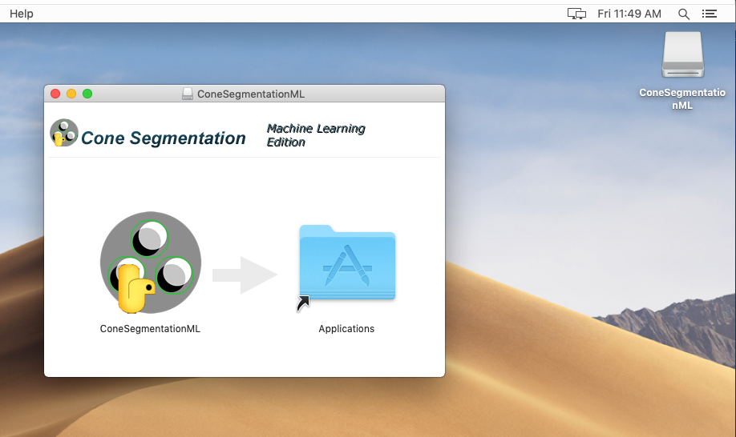
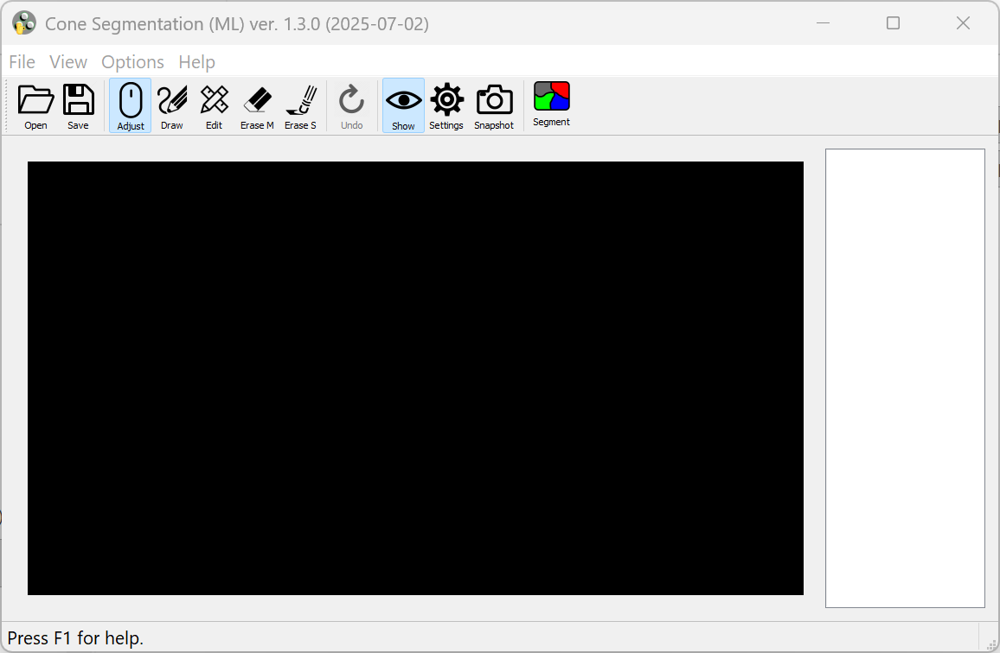
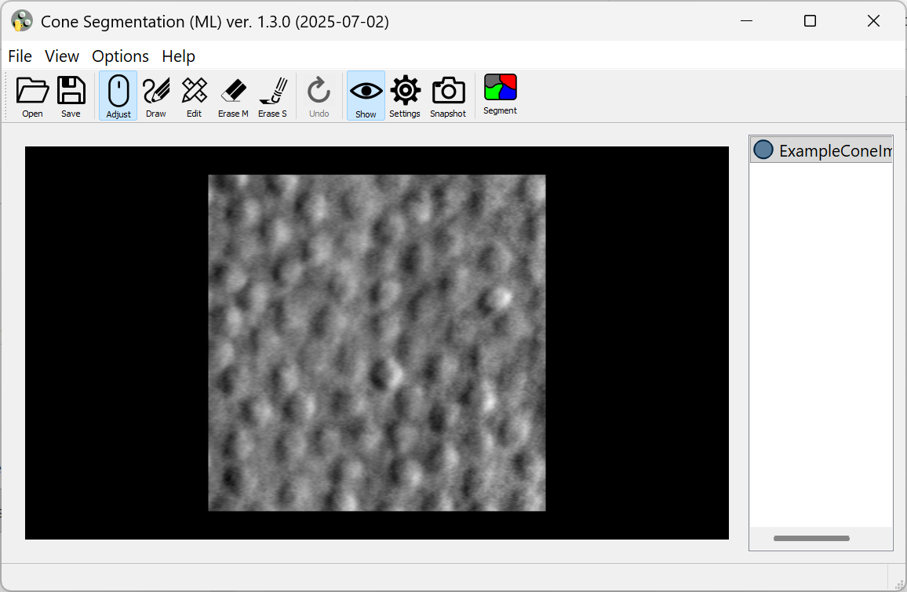
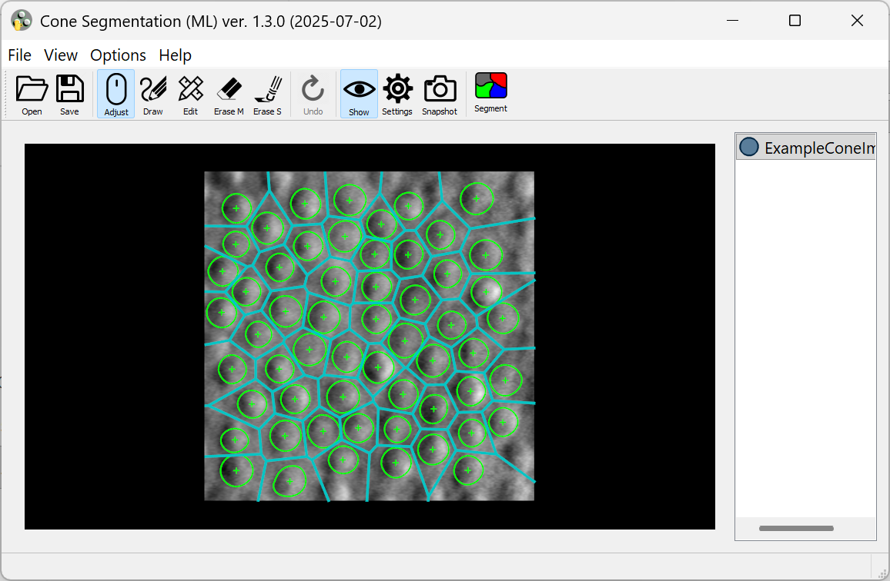
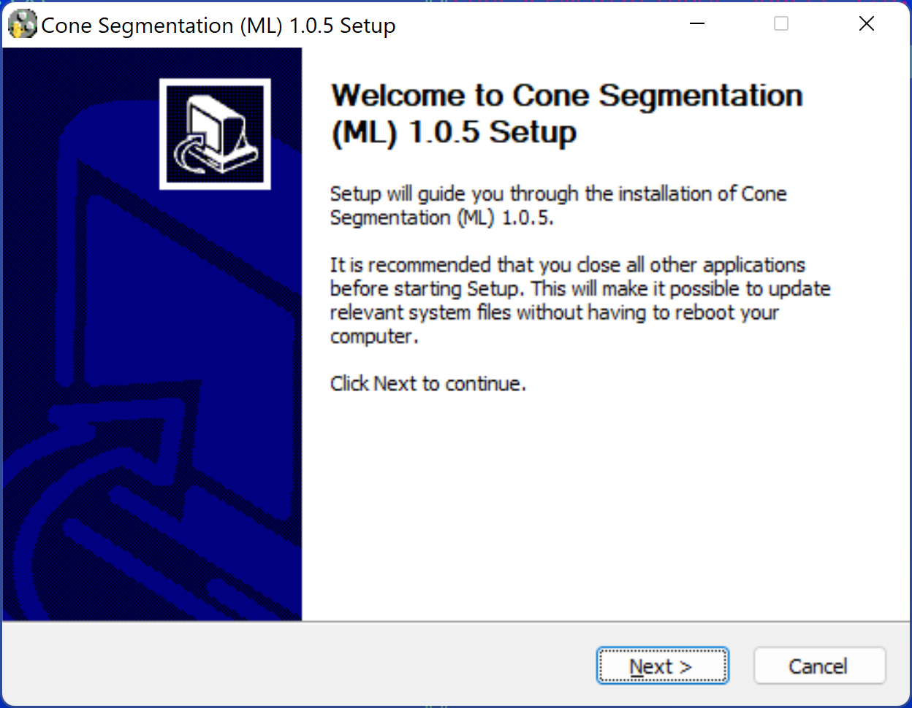

# Cone Segmentation ML (Machine Learning edition)
#### Cell segmentation on Adaptive Optics Retinal Images using pre-trained A-GAN machine learning model and manual editing.

*If any portion of this code is used, please cite the following paper in your publication:*

### BibTeX

	@ARTICLE{9339889,
		author={Liu, Jianfei and Shen, Christine and Aguilera, Nancy and Cukras, Catherine and Hufnagel, Robert B. and Zein, Wadih M. and Liu, Tao and Tam, Johnny},
		journal={IEEE Transactions on Medical Imaging},
		title={Active Cell Appearance Model Induced Generative Adversarial Networks for Annotation-Efficient Cell Segmentation and Identification on Adaptive Optics Retinal Images},
		year={2021},
		volume={40},
		number={10},
		pages={2820-2831},
		doi={10.1109/TMI.2021.3055483}
	}

---------------

## Getting Started

There are two ways to use the software:

- Option 1: Run using prebuilt executables (No installation required)
- Option 2: Install Dependencies and Run from Source

## Option 1: Run using prebuilt executables

1. Download the executable file ( `.exe` for Windows or `.dmg` for Mac OS) from the **Releases** section with the Latest tag.

2. On Windows systems, installation can be completed by double-clicking the `.exe` file and following the on-screen prompts. For Mac OS, the `.dmg` is a Mac OS disk image file.  When opened, it asks for accepting the license agreement, then mounts itself as an external drive and opens a Finder window, that looks like this:

   

   You can run the app by double-clicking on the icon, or copying it to your Applications folder by dragging the icon over "Applications". Once ConeSegmentationML is in your Applications folder, you can eject the *ConeSegmentationML* disk, and delete the `.dmg` file.

3. Once installed, double click on the software icon to open the software.

   

   

4. Click on the **Open** button, to load the input cone image.

   

5. Then click on the **Segment** button to automatically detect the cones.

   

6. The **Mark**, **Erase S**, **Erase M** and **Undo** button allows to add, erase single/multiple and undo past operations.

7. The **Settings** tab provides options to display the centroids of the cones and also highlight the individual cone regions along with the contours.

   

   

8. The **Save** button saves the .CSV file with the contains a sequence of *(x, y)* coordinate pairs that trace the closed contour of the individual cones.

9. The **Help** button provides more documentation about the software features including a table of keyboard shortcuts for common actions

## Option 2: Install Dependencies and Run from Source

### Setting up development environment

1. Download and install [Miniconda](https://docs.conda.io/en/latest/miniconda.html) or [Anaconda](https://www.anaconda.com/products/individual).

2. Check out **ConeSegmentationML** to a local directory `<prefix>/ConeSegementationML`. (Replace `<prefix>` with any suitable local directory).

3. Run Anaconda Prompt (or Terminal), cd to `<prefix>/ConeSegmentationML`.

4. Create Conda Virtual Environment (do this once, next time skip to the next step):

	`conda env create --file conda-environment-win.yml` (Windows)

	`conda env create --file conda-environment-mac.yml` (MAC OS)
   
5. Activate the Virtual Environment:

	`conda activate ConeSegmentation`
   
6. Start the application:

	`python __main__.py`
  
7. Build "frozen Python" application:

	`pyinstaller --clean --noconfirm build-dir.spec`

If successful, the result is the directory `ConeSegmentationML` inside `<prefix>/ConeSegmentationML/dist/`. You can copy this directory with all its contents to a different machine, and run the executable `__main__` (in MacOS and Linux) or `__main__.exe` (in Windows). It does not need Conda VEs or other development tools.

In MacOS systems, you can build a Mac application instead:

`pyinstaller --clean --noconfirm build-app-dir.spec`

The result is `<prefix>/ConeSegmentationML/dist/ConeSegmentationML.app`.

### Creating Windows installer using NSIS

1. Download and install [NSIS](https://nsis.sourceforge.io/Download) if you don't have it already.

2. Follow steps 1 through 7 of *Setting up development environment* to build the directory containing "frozen Python" application.

3. Open Command Prompt (or Conda Prompt), cd to `<prefix>/ConeSegmentationML`.

4. Run NSIS:

`"C:\Program Files (x86)\NSIS\makensis.exe" /V4 build-win64-installer.nsi`

(Replace `C:\Program Files (x86)\NSIS` with the actual installation directory, if different from default).
If successful, the result is `<prefix>/ConeSegmentationML/dist/ConeSegmentationML-{version}-win64.exe`. This is a regular Windows installer, which can be distributed to other Windows systems. It requires admin access.



### Creating MAC OS installer (.dmg)

1. Make sure *Xcode* is installed (normally, via Apple App Store).

2. Install *Node.js*, *npm* and *dmg-license* (require admin/sudo access), if they are not already installed:

	```
	curl -L https://raw.githubusercontent.com/tj/n/master/bin/n -o n
	sudo bash n lts
	sudo npm install --global minimist
	sudo npm install --global dmg-license
	rm n
	```

3. Follow steps 1 through 5 of *Setting up development environment* to setup the development environment.

4. At the Conda prompt with *ConeSegmentation* activated, cd to `<prefix>/ConeSegmentationML` and type the command:

	`bash make_dmg.sh`

If prompted to allow Terminal to run Finder scripts, answer "Allow". The result is `<prefix>/ConeSegmentationML/dist/ConeSegmentationML-{version}-Darwin.dmg`. It is a Mac OS disk image file; when opened, it asks for accepting the license agreement, then mounts itself as an external drive and opens a Finder window, that looks like this:


You can run the app by double-clicking on the icon, or copy it to your Applications folder by dragging the icon over "Applications". Once ConeSegmentationML is in your Applications folder, you can eject the *ConeSegmentationML* disk, and delete *ConeSegmentationML-Darwin.dmg*.

---------------

### Deleting Conda Virtual Environment

To delete the Virtual environment at the Conda prompt, deactivate it first if it is active:

`conda deactivate`

then type:

`conda remove --name ConeSegmentation`